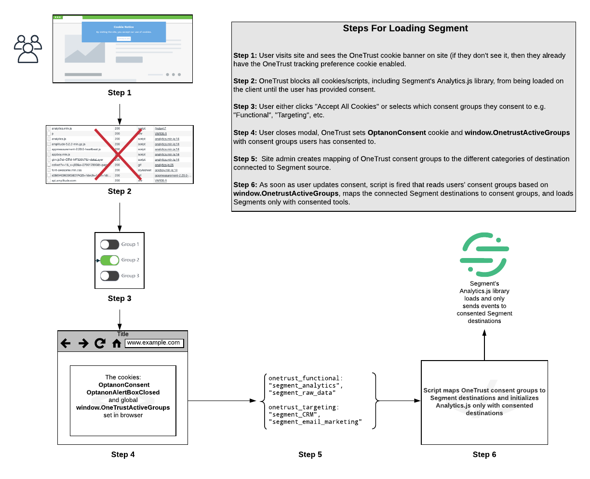
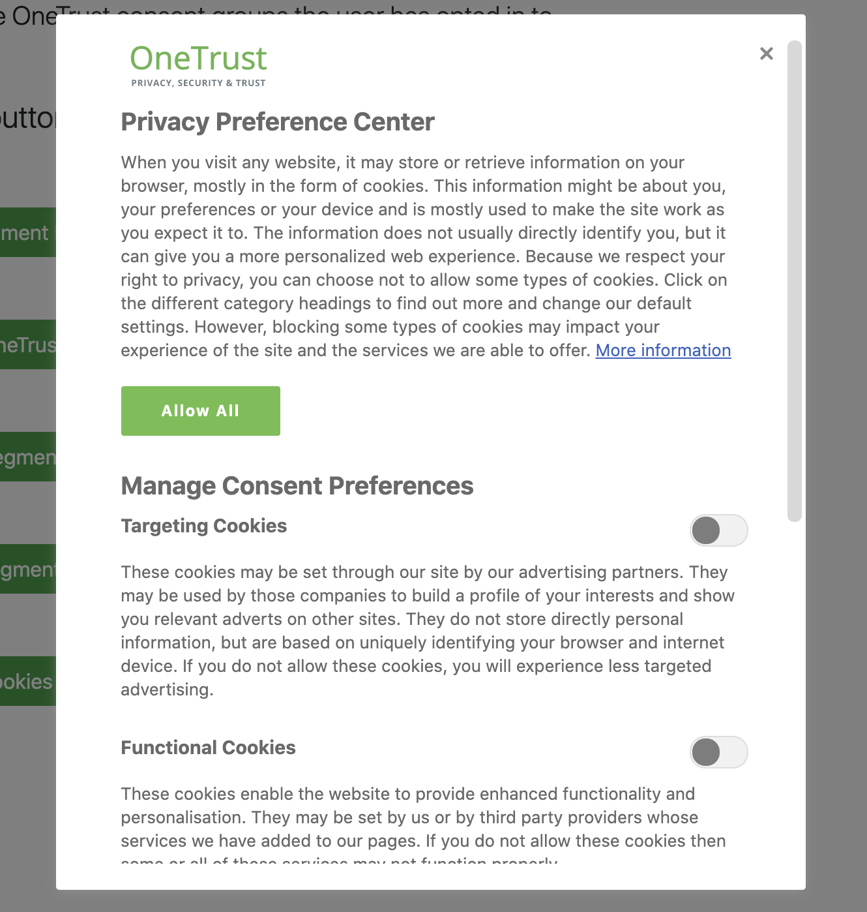
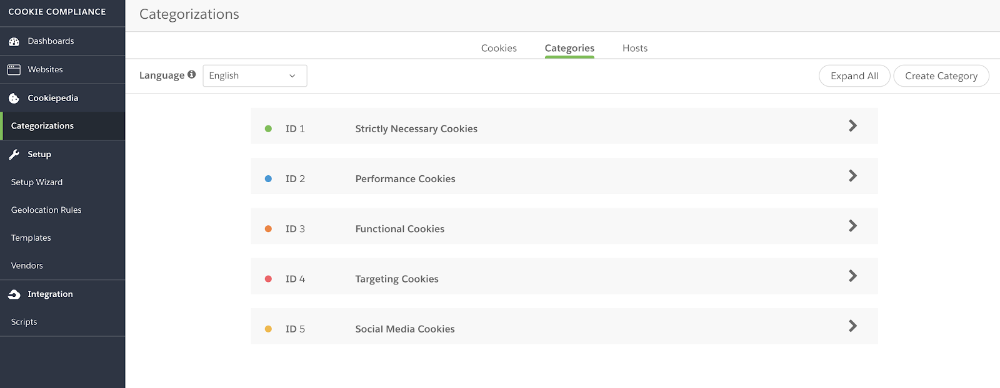
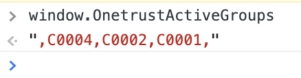
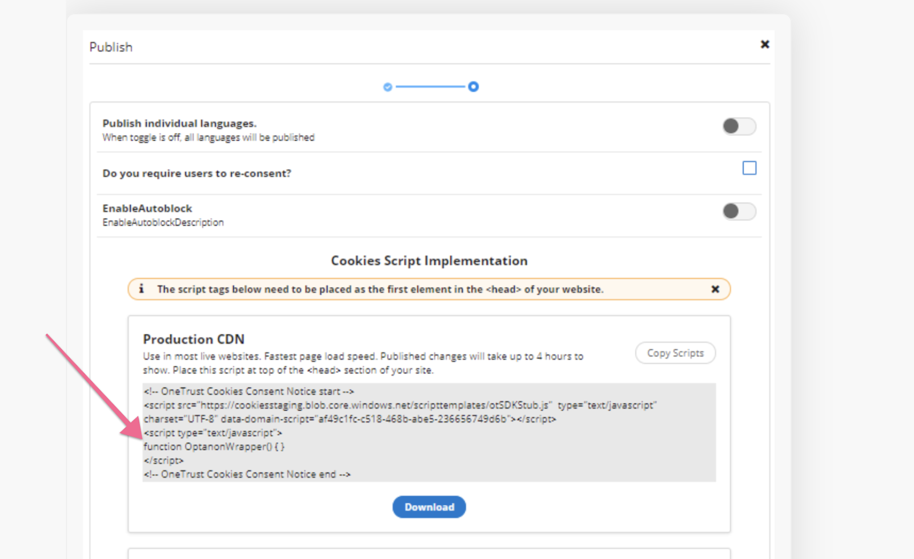
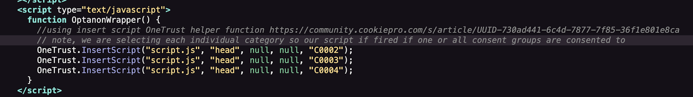
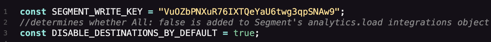
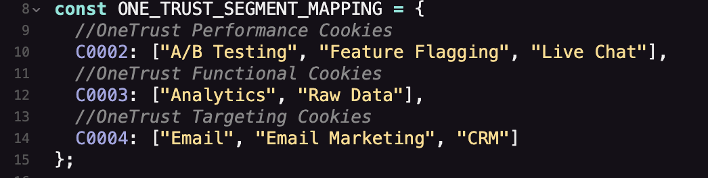

### Introduction:

This demo shows an example of how to integrate [OneTrust’s cookie consent manager](https://www.cookiepro.com/products/cookie-consent/) with [Segment’s Analytics.js](https://segment.com/docs/connections/sources/catalog/libraries/website/javascript/) library for web applications. [Here is a working demo](https://plastic-teal-gasoline.glitch.me/) of how Analytics.js will load based on the OneTrust consent groups a user opts in to. [Click here to view the source code. ](https://glitch.com/edit/#!/plastic-teal-gasoline?path=script.js%3A1%3A0)

### How It Works: 

<strong>Fig 1: Architecture of Analytics.js/OneTrust Integration</strong>

Referencing the diagram above, when the user first visits the site, they will see the OneTrust consent banner and have the option to either accept all cookies or else opt into individual categories. OneTrust will block all cookies/scripts from loading on the site, including Analytics.js, until the user has provided their consent. 

You can configure these categories within your OneTrust dashboard. [Refer to OneTrust’s documentation](https://my.onetrust.com/s/) for more information on how to manage these categories, scan your website for existing cookies and map cookies to categories. 

When a user opts in to tracking for a certain category of cookie tracking (or all categories), OneTrust will set `window.OnetrustActiveGroups` to reflect what categories a user has consented to. [The OptanonConsent cookie](https://my.onetrust.com/s/article/UUID-1e75fb0d-bb79-2af8-cb85-f905d16f1220?topicId=0TO1Q000000ssJBWAY) will also be updated with the consent groups the user has opted into. For example if a user opts into Performance and Targeting cookies `window.OnetrustActiveGroups` will appear as: 

The integration script relies on the optanonWrapper() function to call the script that loads Segment based on ‘window.OnetrustActiveGroups`. This wrapper function will fire on each page load, or whenever the user updates their consent preferences. You can read more about this wrapper function [here](https://my.onetrust.com/s/article/UUID-730ad441-6c4d-7877-7f85-36f1e801e8ca)

Specifically, the script.js that loads Segment is executed using the OneTrust helper function [OneTrust.InsertScript](https://my.onetrust.com/s/article/UUID-730ad441-6c4d-7877-7f85-36f1e801e8ca?topicId=0TO1Q000000ItVuWAK). This helper function dynamically adds an external JavaScript file into the DOM whenever a specified OneTrust consent group is consented to. Since we want Segment to load either based on one or all consent groups being consented to, we trigger our script to load for each individual consent group

The script.js file performs the following once it is called: 

1.  Gets the consent groups from  `window.OnetrustActiveGroups`
2.  Maps them to the destinations connected to your Segment source [write key](https://segment.com/docs/connections/find-writekey/), you need to specify which Segment destinations or destination categories refer to each Onetrust consent group
3. Creates the Analytics.js[ integration object](https://segment.com/docs/connections/sources/catalog/libraries/website/javascript/#managing-data-flow-with-the-integrations-object), which specifies a boolean value for each Segment destination regarding whether data should be sent to it (note, the integration object applies to both [Cloud and Device mode](https://segment.com/docs/connections/destinations/#connection-modes) Segment destinations)
4. The script calls [analytics.load()](https://segment.com/docs/connections/sources/catalog/libraries/website/javascript/#load-options), passing in the integrations object. 

### How to Run Demo Locally: 

1. Clone this Github repo locally
2. Update line 1 one the script.js file with your Segment [source write key](https://segment.com/docs/connections/find-writekey/)
3. Update the OneTrust data-domain-script of the index.html file (line 11) with your [OneTrust id](https://my.onetrust.com/s/article/UUID-5394213a-70b9-c4e6-d68c-f809b55e7af6?topicId=0TO1Q000000ssJBWAY) This id is found within your OneTrust consent manager account, under Scipts -> Publish
4. Indicate whether you want to disable data being sent to Segment destinations by default on line 3 of script.js file (see implementation section below for more information)
5. Open index.html file in the browser/local development server

### How to Implement the Script On Your Landing Page: 

1. Add the OneTrust script tag to your landing page. Make sure to update the `data-domain-script` attribute to match[ what is in your OneTrust workspace](https://my.onetrust.com/s/article/UUID-5394213a-70b9-c4e6-d68c-f809b55e7af6?topicId=0TO1Q000000ssJBWAY) (lines 7-12 of the [demo’s](https://glitch.com/~plastic-teal-gasoline) index.html file).

2. Add the helper functions OneTrust.InsertScript() to insert the file containing the script that loads Segment. Configure the helper function to inject the script for each OneTrust consent group ID you have configure (lines 13-21 of the [demo’s](https://glitch.com/~plastic-teal-gasoline) index.html file).

 with OneTrust.InsertScript()")

3. Verify the [Analytics.js snippet](https://segment.com/docs/connections/sources/catalog/libraries/website/javascript/quickstart/#step-1-copy-the-snippet) has been added to your landing page. Make sure you have removed `analytics.load("VuOZbPNXuR76IXTQeYaU6twg3qpSNAw9");` and    `analytics.page();` from the snippet (lines 24-85 of the [demo’s](https://glitch.com/~plastic-teal-gasoline) index.html file)

4. Add your Segment source write key to line 1 of the script.js file. In line 3 of the same file, Specify whether you would like Segment not to send data to any destinations by default, unless they’re explicitly listed as true in the integrations object. 

For example, if a user provides consent to tools a and b, and a few weeks later, tool c is added to your Segment source, if you specify `true`, Segment would not send data to this new tool. If you specify `false`, Segment would send data to this new tool without explicitly collecting a user’s consent. 

5. In your script.js file, update the ONE_TRUST_SEGMENT_MAPPING object (lines 8-15 of the demo’s script.js file) to specify what Segment destination categories map to which OneTrust cookie category IDs. Add your Segment source write key to [this tool](https://fixed-kind-tartan.glitch.me/) to see what destinations and destination categories are connected to it (lines 8-15 of the [demo’s](https://glitch.com/edit/#!/plastic-teal-gasoline?path=script.js%3A1%3A0) script.js file)

